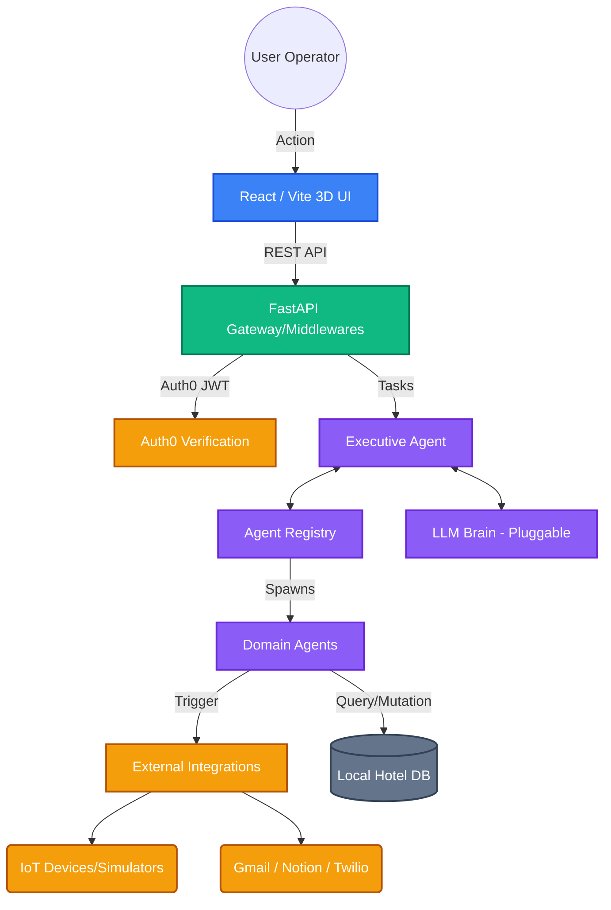
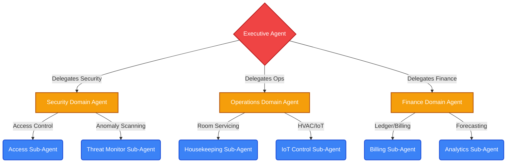
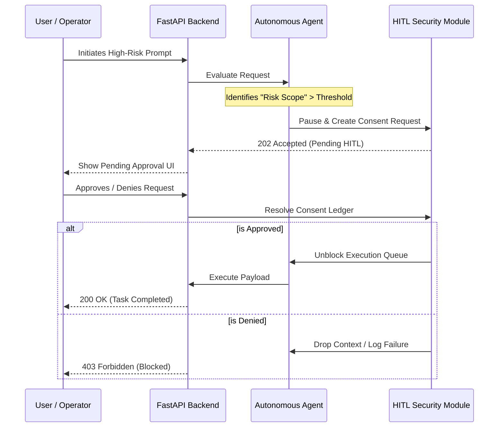

# Aegis Hospitality OS (AHOS) 🏨


> **Research-Grade Multi-Agent Hotel Chain Operating System** designed to flawlessly integrate cutting-edge AI agency, deep operational tooling, and human-in-the-loop security into a single, cohesive pane of glass. Originally developed as an advanced Hackathon project.

---

## 📖 Overview

Aegis Hospitality OS brings the power of **hierarchical LLM-agnostic agents** to hospitality management. It operates through various phases of technological evolution:

*   **Phase 3**: Core backend foundation with Auth0 integration, Rate Limiting, Audit Middlewares, and Background Task Orchestrator.
*   **Phase 4**: Hierarchical Agent System. An "Executive" agent delegates to Domain agents (Security, Operations, Finance), backed by a pluggable LLM "Brain" supporting OpenAI, Gemini, Mistral, Ollama, and Mock providers.
*   **Phase 5**: Real-world integrations connecting AHOS to Gmail, Notion, Twilio, and an internal IoT Simulator.
*   **Phase 6**: **Human-in-the-Loop (HITL) & Security**. Ensures critical agent actions require human consent, complete with attack simulations and anomaly detection. 
*   **Phase 8**: Advanced interactive features surfaced in our highly advanced 3D frontend UI.

## ✨ Key Features

1.  **🎛️ 3D Interactive UI**: A Next-generation React frontend utilizing `@react-three/fiber` for an immersive data management experience.
2.  **🧠 Pluggable LLM Brain**: Zero vendor lock-in. Switch via `.env` between OpenAI, Google Gemini, local Ollama models, or a fallback Mock Brain for consistent latency testing.
3.  **🤝 Hierarchical Agents**: Complex operations are digested by the Executive Agent, fragmented to Domain Agents, and executed by specialized Sub-Agents.
4.  **🛡️ Zero-Trust HITL**: Sensitive automated operations generate "Consent Requests." The AI will pause execution via asynchronous polling until a human operator signs off.
5.  **🔗 Cross-Platform Integrations**: Out-of-the-box automated tooling for Slack, Gmail (Email routing), Twilio (SMS), Notion (Database replication).

---

## 🏛️ System Architecture

### 1. High-Level System Communication



### 2. Multi-Agent Hierarchy

The "Brain" orchestration ensures that context isn't lost. High-level requests from operations are systematically broken down.



### 3. Human-in-the-Loop (HITL) Execution Flow

When an AI Agent attempts an operation that alters secure states (e.g., unlocking a secure door, processing a large refund), AHOS pauses and routes through the HITL framework.



---

## 📁 Repository Structure

```text
AegisResponse_Hackathon/
├── backend/
│   ├── agents/          # Multi-agent AI core (Executive, Domain, Sub-agents)
│   ├── auth/            # Auth0 integrations and JWT validation 
│   ├── database/        # Mock/Local DB connections
│   ├── integrations/    # Connectivity for IoT, Gmail, Notion, Twilio
│   ├── middleware/      # Rate-limiting, Error Handlers, Audit flows
│   ├── monitoring/      # System vitals and logs
│   ├── routes/          # RESTful endpoints grouped chronologically/logically
│   └── services/        # Service mesh & background task queue
│
├── frontend/
│   ├── public/          # Static assets
│   └── src/
│       ├── assets/      # 3d models / image assets
│       ├── components/  # React reusable components
│       ├── pages/       # Route-based views
│       ├── services/    # Frontend API integrations
│       └── App.jsx
│
├── main.py              # Root ASGI entry point targeting /backend
├── requirements.txt     # Python Dependencies
└── .env.example         # Template for environment variables
```

---

## 🚀 Getting Started

### Prerequisites

*   `Python 3.10+`
*   `Node.js 18+` & `npm` or `yarn`
*   [Auth0 Account](https://auth0.com/) for authentication routing

### Environment Setup

1. Copy the example `.env`:
   ```bash
   cp .env.example .env
   ```
2. Populate the `.env` with your secure variables. `LLM_PROVIDER` can be left as `mock` for testing without API keys, or switch to `openai` / `gemini` if you supply an `LLM_API_KEY`.

### 1. Launch Backend (FastAPI)
```bash
# Create and activate a Virtual Environment
python3 -m venv venv
source venv/bin/activate  # On Windows use `venv\Scripts\activate`

# Install Backend requirements
pip install -r requirements.txt

# Run Uvicorn Server
uvicorn main:app --reload --port 8000
```
*The API Docs will be available at `http://localhost:8000/docs`.*

### 2. Launch Frontend (React + Vite)
```bash
# Navigate to frontend
cd frontend

# Install Node modules
npm install

# Start Vite hot-reload server
npm run dev
```
*The Interactive OS will surface gracefully on `http://localhost:5173`.*

---
